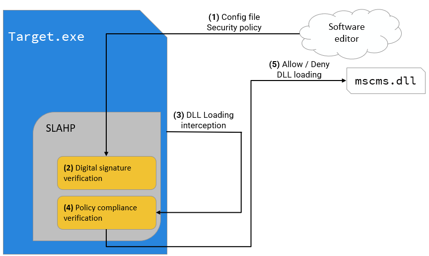

## SLAHP : Share Library Anti Hijacking Protector

**This is a crude README file that will be updated soon.**

SLAHP is a software component that aims to make protecting one's software againt DLL Search Order Hijacking vulnerabilities as easy as it can be. It works by using a security policy that details which DLLs can be loaded (based on hashes and/or PE digital signatures) and intercepting every attempt of a protected program at loading a DLL, allowing it or denying based on security policy compliancy.

Our main goals with SLAHP were:

- (Optional) Invisibility to the user
  
  - Small performance impact
  
  - Optional alerts to the user upon denial of DLL loading

- Easy to integrate
  
  - Static library (1-liner to initialise SLAHP)
  
  - Launcher
    
    - Uses DLL injection to protect a newly created process.

## Licensing

Apart from the following components, this whole repository is licensed under Academic Software Evaluation License, detailed in the LICENSE.txt file.

- Microsoft Detours - [MIT License](https://github.com/microsoft/Detours/blob/main/LICENSE.md)
  
  - `./detours.h`
  
  - `./detours_x64.lib`
  
  - `./detours_x86.lib`

- Boost : Base64 - [Boost Software License, Version 1.0](http://www.boost.org/LICENSE_1_0.txt)
  
  - `./SignatureTool/base64.h`

All these license considerations extend to the compiled binary files that may be present in this repository.

## Project organisation

The Visual Studio solution is subdivided in the following projects:

- Protector
  
  - The main protection component, responsible for loading the security policy, placing hooks and analysing the compliance of to-be-loaded DLLs with the security policy.

- SignatureTool
  
  - Allows the creation of security policy digital signatures.

- PerfTests
  
  - Project aimed at facilitating the benchmark of SLAHP's peformance.

- DumbImporter
  
  - A simple test program, not really useful.

- ProtectedLauncher & ProtectorAgent
  
  - The launcher & DLL projects behind the Launcher integration.

- LauncherCreator
  
  - A tool to create launchers and their associated DLLs.

## Caveats

**This section is incomplete. I will complete it later with details from the THCon's presentation slides.**

- Child processes with a different executable name aren't protected